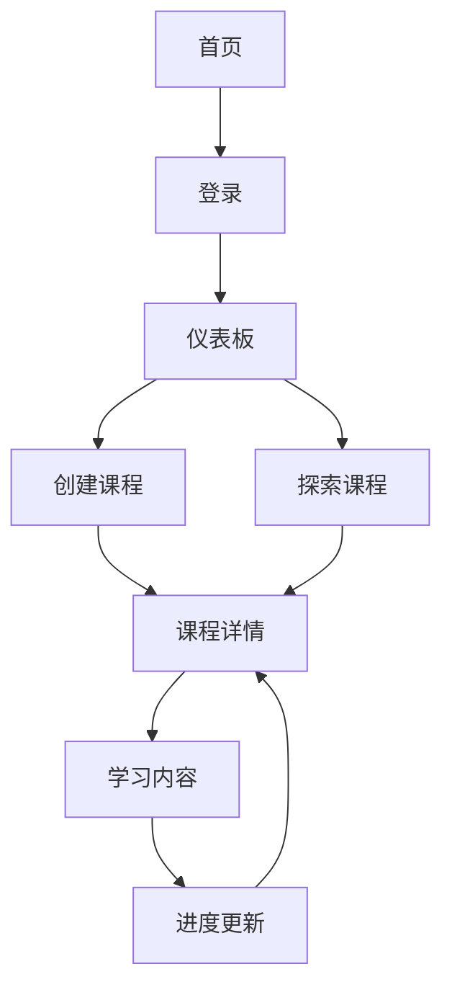

# 按钮功能审计与重构需求文档

## 1. 产品概述

本文档针对"智学奇点"应用内所有按钮组件进行全面的功能审计与重构，旨在优化交互逻辑、统一状态管理、修复功能缺陷，并提升用户体验和代码质量。

## 2. 核心功能

### 2.1 用户角色

| 角色    | 权限范围   | 核心功能                 |
| ----- | ------ | -------------------- |
| 未登录用户 | 基础浏览权限 | 可浏览课程、查看内容，但无法创建或学习  |
| 已登录用户 | 完整功能权限 | 可创建课程、学习课程、管理进度、收藏内容 |
| 课程创建者 | 课程管理权限 | 可发布、编辑自己创建的课程        |

### 2.2 功能模块

本次重构涉及以下7个核心页面的按钮功能：

1. **首页**：登录按钮、导航按钮、CTA按钮
2. **导航栏**：登录/登出、用户菜单、页面导航按钮
3. **仪表板页面**：创建课程、筛选切换、课程操作按钮
4. **课程创建页面**：AI生成、表单提交、难度选择按钮
5. **课程探索页面**：搜索、筛选、视图切换、加载更多按钮
6. **课程详情页面**：学习控制、章节导航、AI助手按钮
7. **课程卡片组件**：学习入口、进度显示按钮

### 2.3 页面详情

| 页面名称 | 模块名称 | 功能描述                        |
| ---- | ---- | --------------------------- |
| 首页   | 登录认证 | GitHub OAuth登录，状态持久化，登录后重定向 |
| 首页   | 导航操作 | 页面跳转，路由状态管理，面包屑导航           |
| 导航栏  | 用户菜单 | 下拉菜单切换，用户信息显示，登出确认          |
| 导航栏  | 快速操作 | 创建课程、收藏管理、内容广场入口            |
| 仪表板  | 课程管理 | 创建新课程，课程状态筛选，进度统计           |
| 仪表板  | 数据展示 | 学习统计，课程分类，空状态处理             |
| 创建页面 | AI生成 | 智能标题描述生成，加载状态，错误重试          |
| 创建页面 | 表单提交 | 课程创建，验证处理，成功跳转              |
| 探索页面 | 内容筛选 | 搜索过滤，标签筛选，视图模式切换            |
| 探索页面 | 分页加载 | 无限滚动，加载状态，网络错误处理            |
| 课程详情 | 学习控制 | 章节解锁，进度更新，学习状态同步            |
| 课程详情 | 交互功能 | AI助手切换，内容标签，分享操作            |
| 课程卡片 | 数据显示 | 章节数量显示，学习进度，创建者信息           |
| 课程卡片 | 操作入口 | 学习入口，继续学习，课程预览              |

## 3. 核心流程

### 3.1 用户认证流程

用户点击登录按钮 → GitHub OAuth认证 → 获取用户信息 → 更新全局状态 → 重定向到目标页面

### 3.2 课程创建流程

用户输入学习需求 → AI生成标题描述 → 用户确认编辑 → 选择难度级别 → 提交创建 → AI生成大纲 → 跳转课程页面

### 3.3 学习进度流程

用户选择课程 → 检查解锁状态 → 开始学习 → 更新进度 → 解锁下一章节 → 同步状态到服务器

## 4. 用户界面设计

### 4.1 设计风格

* **主色调**：蓝色系 (#3B82F6) 和紫色系 (#8B5CF6)

* **辅助色**：灰色系 (#6B7280) 和绿色系 (#10B981)

* **按钮样式**：圆角设计，渐变背景，悬浮阴影效果

* **字体**：Inter字体，14px基础大小，16px标题大小

* **布局风格**：卡片式布局，顶部导航，响应式网格

* **图标风格**：Lucide图标库，线性风格，4px描边

### 4.2 页面设计概览

| 页面名称 | 模块名称   | UI元素                      |
| ---- | ------ | ------------------------- |
| 首页   | 登录按钮   | 蓝色渐变背景，白色文字，GitHub图标，悬浮效果 |
| 导航栏  | 用户菜单   | 圆形头像，下拉动画，分割线，图标标签        |
| 仪表板  | 创建按钮   | 主色调背景，Plus图标，阴影效果，点击反馈    |
| 创建页面 | AI生成按钮 | 渐变边框，Sparkles图标，加载动画，禁用状态 |
| 探索页面 | 筛选按钮   | 轮廓样式，Filter图标，激活状态，切换动画   |
| 课程详情 | 学习按钮   | 大尺寸设计，箭头图标，进度指示，状态变化      |
| 课程卡片 | 操作按钮   | 小尺寸设计，悬浮显示，渐变背景，文字变化      |

### 4.3 响应式设计

产品采用移动优先的响应式设计，支持桌面端和移动端的触摸交互优化，按钮尺寸和间距根据屏幕大小自适应调整。

## 5. 技术实现要求

### 5.1 状态管理重构

**使用Zustand进行状态管理：**

* 创建统一的UI状态store管理按钮状态

* 实现加载状态、错误状态、禁用状态的集中管理

* 提供状态持久化和状态重置功能

### 5.2 数据请求优化

**采用tRPC实现类型安全：**

* 所有按钮触发的数据操作使用tRPC mutation

* 实现乐观更新和错误回滚机制

* 添加请求缓存和重试逻辑

### 5.3 关键问题修复

**已识别的功能缺陷：**

1. course-card组件章节数硬编码为0，需要显示实际章节数量
2. 按钮加载状态不统一，需要标准化加载指示器
3. 错误处理机制缺失，需要添加用户友好的错误提示
4. 状态管理分散，需要集中化管理
5. 部分按钮缺少禁用逻辑，需要添加条件判断

### 5.4 性能优化

* 实现按钮防抖机制，避免重复点击

* 优化状态更新频率，减少不必要的重渲染

* 添加组件懒加载和代码分割

* 实现智能缓存策略，提升响应速度

