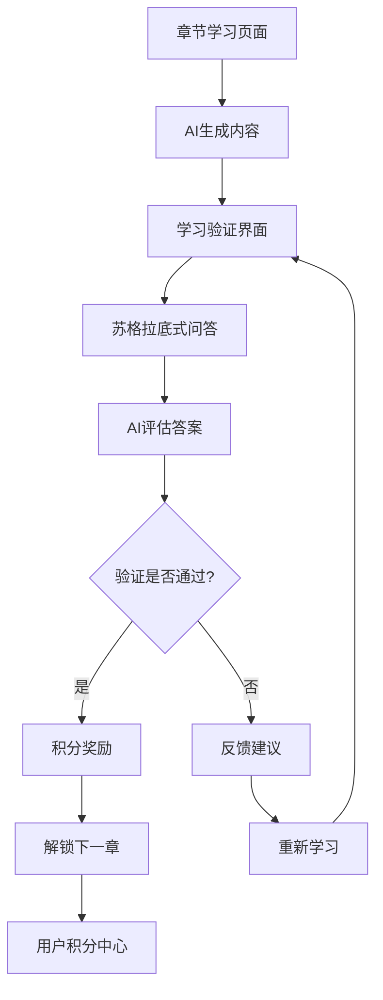

## 1. Product Overview

本次升级将为LeapMind学习平台引入「学习验证」环节和积分奖励系统，从简单的AI内容生成直接解锁模式，升级为基于苏格拉底式问答的深度学习验证机制。用户需要通过AI验证问答环节证明对章节内容的理解，才能解锁下一章节，同时获得积分奖励以提升学习动机。

这一升级将显著提升学习效果和用户参与度，确保用户真正掌握知识而非仅仅浏览内容，打造更有价值的学习体验。

## 2. Core Features

### 2.1 User Roles

| Role | Registration Method | Core Permissions |
|------|---------------------|------------------|
| 学习者 | 现有用户系统 | 参与学习验证、获得积分奖励、查看学习进度 |
| 课程创建者 | 现有用户系统 | 创建课程、查看学习数据、设置验证难度 |

### 2.2 Feature Module

本次升级主要涉及以下核心页面和模块：

1. **章节学习页面**：新增学习验证环节、积分显示、进度追踪
2. **用户积分中心**：积分总览、获得记录、成就展示
3. **学习验证界面**：苏格拉底式问答、AI反馈、通关判定
4. **课程管理页面**：验证设置、学习数据分析

### 2.3 Page Details

| Page Name | Module Name | Feature description |
|-----------|-------------|---------------------|
| 章节学习页面 | 学习验证环节 | 在AI生成内容后触发验证，展示3-5个苏格拉底式问题，收集用户答案并提交AI评估 |
| 章节学习页面 | 积分奖励显示 | 显示当前积分、本章可获得积分、通关后的积分动画效果 |
| 章节学习页面 | 验证结果反馈 | 展示AI评估结果、详细反馈、是否通过验证、重试机制 |
| 用户积分中心 | 积分总览 | 显示总积分、等级、排行榜位置、积分获得历史 |
| 用户积分中心 | 成就系统 | 学习成就、连续学习天数、完成课程数量等徽章展示 |
| 学习验证界面 | 问题生成 | AI根据章节内容生成3-5个渐进式苏格拉底问题 |
| 学习验证界面 | 答案收集 | 多种输入方式（文本、选择题、简答），支持草稿保存 |
| 学习验证界面 | AI评估 | 实时评估用户理解程度，提供个性化反馈和建议 |
| 课程管理页面 | 验证设置 | 创建者可设置验证难度、通过标准、积分奖励数值 |
| 课程管理页面 | 学习分析 | 查看学习者验证通过率、平均分数、常见问题分析 |

## 3. Core Process

### 学习者验证流程

1. **内容学习**：用户点击生成内容，AI生成章节学习材料
2. **触发验证**：内容生成完成后，自动进入学习验证环节
3. **问题展示**：系统展示3-5个苏格拉底式问题，引导深度思考
4. **答案提交**：用户逐一回答问题，可保存草稿和修改
5. **AI评估**：提交后AI实时评估理解程度和答案质量
6. **结果反馈**：显示评估结果、详细反馈、是否通过验证
7. **积分奖励**：通过验证后获得积分，触发奖励动画
8. **解锁下一章**：验证通过后解锁下一章节，更新学习进度
9. **重试机制**：未通过可重新学习内容并再次验证

### 积分奖励流程

1. **基础积分**：完成章节验证获得基础积分（10-50分）
2. **质量加分**：高质量答案获得额外积分（最多20分）
3. **连续学习**：连续天数学习获得倍数奖励
4. **首次通过**：首次通过验证获得额外奖励
5. **完课奖励**：完成整个课程获得大额积分奖励

## 4. User Interface Design

### 4.1 Design Style

- **主色调**：保持现有的蓝色系（#3B82F6），新增金色积分元素（#F59E0B）
- **按钮样式**：圆角按钮，验证通过使用绿色（#10B981），失败使用红色（#EF4444）
- **字体**：Inter字体，标题16-20px，正文14-16px
- **布局风格**：卡片式设计，渐进式信息展示，清晰的步骤指引
- **图标风格**：使用Lucide图标库，积分使用星星、奖杯等奖励类图标
- **动画效果**：积分获得时的粒子效果，进度条动画，成功验证的庆祝动画

### 4.2 Page Design Overview

| Page Name | Module Name | UI Elements |
|-----------|-------------|-------------|
| 章节学习页面 | 学习验证环节 | 问题卡片、进度指示器、提交按钮、积分预览 |
| 章节学习页面 | 积分奖励显示 | 积分数字、奖励动画、等级进度条、成就提示 |
| 学习验证界面 | 问题展示 | 渐进式问题卡片、思考提示、答案输入框、保存草稿 |
| 学习验证界面 | 结果反馈 | 评分显示、详细反馈文本、通过/失败状态、重试按钮 |
| 用户积分中心 | 积分总览 | 大数字显示、圆形进度图、排行榜列表、历史图表 |
| 用户积分中心 | 成就系统 | 徽章网格、解锁动画、成就描述、分享功能 |

### 4.3 Responsiveness

产品采用移动优先的响应式设计，确保在手机、平板和桌面端都有良好的学习体验。验证界面针对触屏操作优化，支持手势滑动和点击交互。