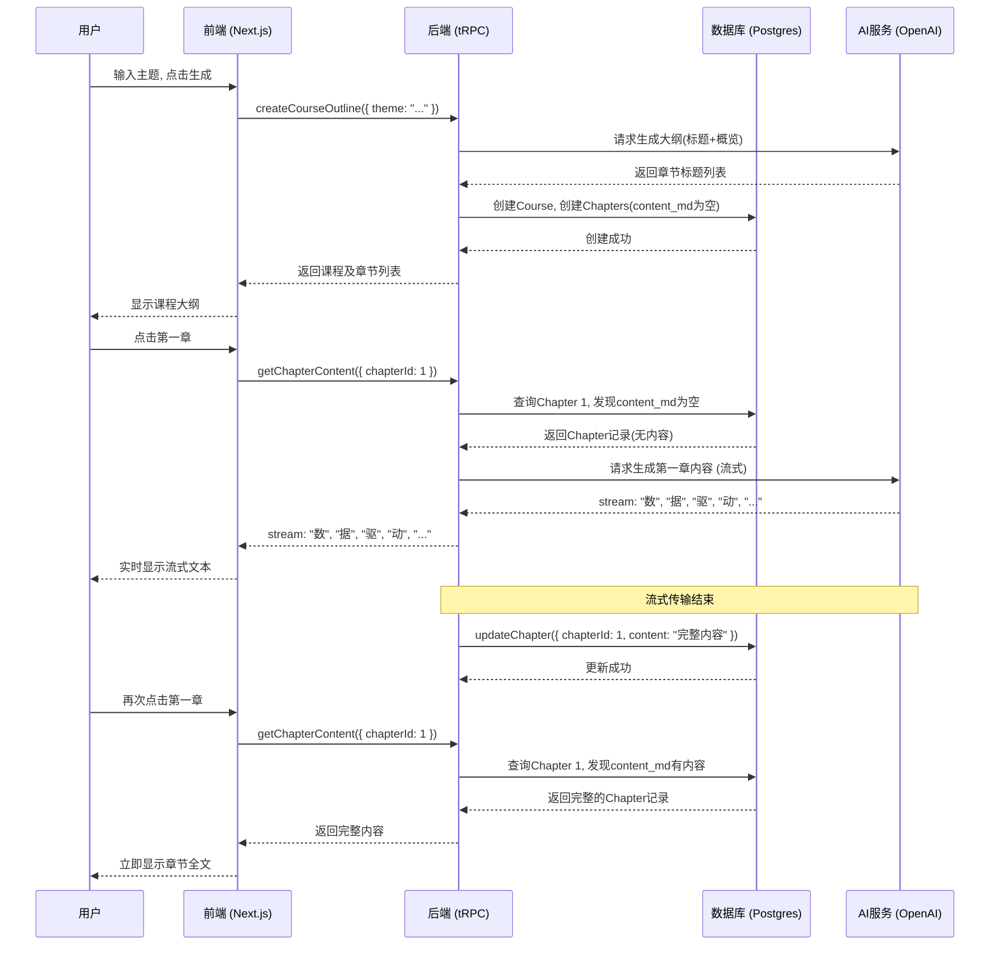

### **产品需求文档 (PRD): “智学奇点” (Singularity Scholar)**

### **1. 背景与战略 (The Why)**

#### **1.1 产品概述 (Executive Summary)**

“智学奇点”是一个由AI驱动的个性化学习与知识分享平台。它旨在解决当前在线学习中“内容过载、引导缺失”和“学习孤立、反馈滞后”的核心痛点。通过AI即时生成个性化学习路径，并结合一个由用户贡献内容（UGC）驱动的社区，我们为终身学习者提供从“启动”到“精通”的完整闭环，并构建一个自增长的知识生态系统。

#### **1.2 问题陈述 (Problem Statement)**

1.  **知识获取效率低:** 学习者在面对新领域时，需要耗费大量时间筛选、甄别、组织信息，才能构建出有效的学习框架。
2.  **学习过程孤立:** 传统的在线学习缺乏互动与反馈，学习者容易“闭门造车”，遇到瓶颈时难以获得即时帮助，最终导致放弃。
3.  **优质内容未沉淀:** 个体学习者宝贵的学习路径和心得体会，往往是碎片化的、一次性的，未能被有效沉淀和复用，造成社会性知识资产的浪费。

#### **1.3 我们的解决方案 (Solution)**

“智学奇点”通过以下两大核心机制应对上述挑战：

1.  **AI智慧导师 (AI Mentor):** 用户只需输入一个主题，AI即可为其量身定制一套结构化的学习课程，并通过苏格拉底式的互动问答引导其深度学习，提供即时反馈。
2.  **知识共创广场 (Community Hub):** 用户可以将自己验证过的高质量学习路径一键发布到“内容广场”，供他人“克隆”和学习。这不仅激励了内容创作，也让后来者可以“站在前人的肩膀上”，高效起步。

#### **1.4 战略目标与成功指标 (Goals & KPIs)**

| 目标类型 | 目标描述 | 核心成功指标 (KPIs) |
| :--- | :--- | :--- |
| **用户体验** | 提供极致个性化、无挫败感、且富有成就感的学习闭环。 | - **任务成功率:** 首次课程通过率 \> 70% \<br\>- **用户满意度 (NPS):** \> 40 |
| **产品粘性** | 通过个人成长记录与社区互动，最大化用户留存。 | - **7日用户留存率:** \> 25% \<br\>- **内容贡献率:** (发布课程的用户 / 月活跃用户) \> 5% |
| **生态健康** | 激活UGC生态，形成“创造-分享-学习”的良性循环。 | - **内容消费率:** (从社区克隆课程的用户 / 新用户) \> 30% \<br\>- **日均评估次数:** \> 10,000次 |

-----

### **2. 目标用户与核心场景 (The Who & The How)**

#### **2.1 目标用户画像 (Personas)**

  * **“破局者” 张伟 (Mid-career Professional), 32岁:**

      * **场景:** 为了职业转型，需要快速学习“人工智能产品管理”这一新领域。
      * **痛点:** 网上资料繁杂，不知从何学起。希望能有一条清晰的路径图，并参考同行的学习经验，避免走弯路。渴望在学习过程中得到反馈和验证。
      * **核心需求:** 快速搭建知识框架、验证学习成果、参考他人路径。

  * **“探索家” 李静 (University Student), 20岁:**

      * **场景:** 对“量子计算”感到好奇，但学校课程尚未覆盖。
      * **痛点:** 官方教材枯燥难懂。希望能有一位“有趣的老师”用通俗易懂的方式引导入门，并能发现一些经过真人验证的、非主流但极具启发性的学习资源。
      * **核心需求:** 趣味性引导、发现新知、低门槛入门。

#### **2.2 核心用户旅程 (Core User Journeys)**

**旅程1: AI引导式学习 (新用户 - 张伟) - *v1.0修订版***

1.  **发现:** 张伟进入平台，首页提示他“输入任何你想学习的主题”。
2.  **创建:** 他输入“人工智能产品管理”，选择“有基础”。
3.  **生成大纲:** AI在**极短时间内（约2-3秒）为他生成了一个包含8个章节的课程大纲（仅含标题和概览）**。
4.  **首次学习章节:** 他点击第一章“核心概念”。页面显示加载状态，后台**首次调用AI生成该章节的具体内容**。
5.  **流式呈现:** AI内容以**对话流**的形式实时传输到他的屏幕上。生成完毕后，内容被**自动保存**到数据库。
6.  **评估:** 学习完后，AI提出问题：“请用你的话解释，数据驱动决策在AI产品管理中的重要性体现在哪三个方面？”
7.  **反馈:** 张伟提交回答。AI立即评分（85/100）并给出评语。
8.  **进阶:** 他顺利解锁下一章。
9.  **二次学习章节:** 几天后，张伟再次点击第一章“核心概念”，系统**直接从数据库中读取已保存的内容**，并立即显示，不再调用AI。

**旅程2: 社区驱动式学习 (新用户 - 李静)**

1.  **发现:** 李静没有明确目标，她进入“内容广场”。
2.  **浏览:** 她被一个标题为《三小时搞懂量子纠缠：一个“薛定谔的袜子”比喻》的课程吸引，该课程已有2000+人学习。
3.  **克隆:** 她点击“克隆课程”，该课程立刻出现在她的个人“学习履历”中。
4.  **学习与贡献:** 她按照克隆的路径开始学习，并在学完后，对其中一篇她认为解释得特别好的内容点了“👍”。
5.  **分享:** 完成整个课程后，她觉得收获巨大。她将自己创建的另一门《用科幻电影理解相对论》课程，在稍作优化后，也发布到了广场。

-----

### **3. 产品功能需求 (The What)**

#### **3.1 功能总览 (Feature Summary)**

v1.0的核心是构建完整的单人学习闭环和基础的社区分享能力。

| 史诗 (Epic) | 用户故事ID | 用户故事描述 | 优先级 |
| :--- | :--- | :--- | :--- |
| **E0: 用户认证** | US0.1 | 作为一个新用户，我希望能通过GitHub账号快速登录，以便开始使用平台功能。 | **P0 (MVP)** |
| **E1: 核心学习体验** | US1.1 | 作为一个学习者，我希望能输入主题和我的当前水平，以便AI为我**快速生成一个仅包含章节标题的结构化课程大纲**。 | **P0 (MVP)** |
| | US1.2 | 作为一个学习者，当我**首次点击**一个未生成的章节时，我希望能看到AI**流式生成**该章节的具体内容，并在生成后**自动保存**。 | **P0 (MVP)** |
| | US1.3 | 作为一个学习者，当我**再次点击**一个已生成的章节时，我希望能**直接从数据库快速加载**其内容。 | **P0 (MVP)** |
| | US1.4 | 作为一个学习者，我希望在每章结束后通过问答形式进行评估，以便检验我的学习效果并获得AI的即时反馈。 | **P0 (MVP)** |
| | US1.5 | 作为一个学习者，当我对AI的提问卡壳时，我希望能请求一次提示，以便帮助我继续思考。 | **P1** |
| | US1.6 | 作为一个学习者，如果我多次评估失败，我希望能请求AI“换个方式重讲”，以便从不同角度理解核心概念。 | **P1** |
| **E2: 个人学习管理** | US2.1 | 作为一个用户，我希望能有一个“学习履历”页面，来统一管理我所有正在学习和已完成的课程。 | **P0 (MVP)** |
| | US2.2 | 作为一个学习者，我希望能清晰地看到每门课程的进度，并能随时回顾历史学习内容与评估记录。 | **P0 (MVP)** |
| | US2.3 | 作为一个用户，我希望系统能记录我的连续学习天数并给予徽章奖励，以便激励我保持学习习惯。 | **P1** |
| **E3: 社区与分享** | US3.1 | 作为一个用户，我希望能浏览一个“内容广场”，发现其他用户分享的优质课程。 | **P0 (MVP)** |
| | US3.2 | 作为一个用户，我希望能将广场上的课程一键“克隆”到我的学习履历中，开始我自己的学习。 | **P0 (MVP)** |
| | US3.3 | 作为一个创作者，我希望能将自己已完成且符合标准的课程发布到广场，与他人分享。 | **P1** |
| | US3.4 | 作为一个学习者，我希望能对每一篇学习内容的质量进行点赞/点踩的快速反馈。 | **P1** |

#### **3.2 功能详述 (User Story Details)**

**(示例) US1.1: AI快速生成课程大纲**

  * **用户故事:** 作为一个学习者，我希望能输入主题和我的当前水平，以便AI为我快速生成一个仅包含章节标题和概览的结构化课程大纲。
  * **验收标准 (Acceptance Criteria):**
    1.  在首页或课程创建页，必须有一个文本输入框用于输入“学习主题”。
    2.  必须提供至少两个水平选项：“初学者”、“有基础”。
    3.  点击“生成课程”按钮后，页面应显示加载状态。
    4.  AI生成的课程大纲必须以结构化列表（章节标题和概览）的形式呈现。
    5.  生成的章节数应在5到10章之间。
    6.  后台数据库中，`Course`被创建，关联的多个`Chapter`记录也被创建，但`content_md`字段为空。

**(示例) US1.2: 按需流式生成并保存章节内容**

  * **用户故事:** 作为一个学习者，当我首次点击一个未生成的章节时，我希望能看到AI流式生成该章节的具体内容，并在生成后自动保存。
  * **验收标准 (Acceptance Criteria):**
    1.  当用户点击一个 `content_md` 字段为空的章节链接时，前端应显示加载状态。
    2.  后端根据该章节标题和课程主题调用AI服务，并以流式（Stream）方式返回响应。
    3.  前端实时渲染文本流，给用户“AI正在写作”的观感。
    4.  文本流结束后，完整的Markdown内容被自动发送到后端并更新到对应`Chapter`的`content_md`字段中，完成持久化。
    5.  如果AI生成失败，必须向用户显示明确的错误提示和重试选项。

-----

### **4. 需求范围与技术实现 (The Scope & The How-To)**

#### **4.1 非功能性需求 (Non-Functional Requirements)**

| 类别 | 需求描述 |
| :--- | :--- |
| **性能** | - 95%的**AI大纲生成**请求应在**3秒**内完成。\<br\>- 95%的**AI章节内容生成**请求应在**8秒**内完成（流式首包时间\<2秒）。\<br\>- 95%的AI评估反馈请求应在5秒内完成。\<br\>- 核心页面（广场、履历）的首次内容加载时间 (LCP) 应小于2.5秒。 |
| **可用性** | - 产品需遵循WCAG 2.1 AA标准，保证基础的无障碍访问。\<br\>- 界面设计需在主流桌面和移动端浏览器上响应式兼容。 |
| **安全性** | - OAuth 2.0 + GitHub Provider确保安全的第三方登录。\<br\>- 所有API通信必须使用HTTPS。\<br\>- 防止恶意的Prompt注入攻击。\<br\>- NextAuth.js会话管理和CSRF保护。 |
| **可扩展性** | - 架构设计应能支持未来用户量增长10倍，而无需重构核心服务。 |

#### **4.2 技术栈 (Tech Stack for v1.0)**

  * **前端框架:** Next.js (App Router), React, TypeScript
  * **样式方案:** Tailwind CSS
  * **状态管理:** @tanstack/react-query (TanStack Query) 和 zustand
  * **API层:** tRPC (类型安全的全栈API)
  * **数据库:** PostgreSQL (搭配 Prisma ORM)
  * **身份验证:** NextAuth.js + GitHub Provider + Prisma Adapter
  * **核心智能:** OpenAI GPT-4o API
  * **部署:** Vercel

#### **4.3 数据模型 (Data Models)**

**User (用户)**
| `id` | `UUID` / `SERIAL` | **主键**，用户唯一标识符。 |
| `email` | `String` | 用户的电子邮件地址，唯一，用于登录和接收通知。 |
| `name` | `String` | 用户姓名（从GitHub获取）。 |
| `image` | `String?` | 用户头像URL（从GitHub获取，可选）。 |
| `github_id` | `String?` | GitHub用户ID（OAuth登录时使用）。 |
| `emailVerified` | `DateTime?` | 邮箱验证时间（NextAuth.js标准字段）。 |
| `createdAt` | `DateTime` | 用户的注册时间戳。 |
| `updatedAt` | `DateTime` | 用户信息最后更新时间。 |

#### **2. Course (课程)**

定义了一门完整的课程，无论是AI生成还是用户创建。

| 字段名 (Field) | 类型 (Type) | 描述 (Description) |
| :--- | :--- | :--- |
| `id` | `UUID` / `SERIAL` | **主键**，课程唯一标识符。 |
| `title` | `String` | 课程的标题。 |
| `description` | `Text` | 课程的简要描述。 |
| `creator_id` | `ForeignKey (User.id)` | 课程创建者的ID。对于AI直接生成的课程，可以指向一个系统账户。 |
| `is_public` | `Boolean` | 课程是否在“内容广场”公开。默认为 `false`。 |
| `cloned_by_count` | `Integer` | 该课程被用户克隆的总次数，用于“最热”排序。默认为 `0`。 |
| `average_score_sum`| `BigInt` | 该课程下所有评估得分的总和，用于计算平均分。 |
| `total_assessments_count` | `Integer` | 该课程下完成的总评估次数。**平均分 = sum / count**。 |
| `createdAt` | `DateTime` | 课程的创建时间戳。 |

**Chapter (章节)**

  * `id`: `UUID` / `SERIAL` (PK)
  * `courseId`: `ForeignKey (Course.id)`
  * `chapter_number`: `Integer`
  * `title`: `String`
  * `content_md`: `Text?` (**关键: 初始创建时允许为空，按需填充**)
  * `content_quality_score`: `Float` (**内容质量评分, 范围0-100**)
  * `generation_cost`: `Decimal` (**记录AI生成该内容的token消耗成本**)
  * `last_updated`: `DateTime` (**内容最后一次更新的时间戳**)

**UserCourseProgress (用户课程进度)**

  * `id`: `UUID` / `SERIAL` (PK)
  * `userId`: `ForeignKey (User.id)`
  * `courseId`: `ForeignKey (Course.id)`
  * `status`: `Enum ('in_progress', 'completed')`
  * `unlocked_chapters_json`: `JSONB`

**Assessment (评估记录)**

  * `id`: `UUID` / `SERIAL` (PK)
  * `chapterId`: `ForeignKey (Chapter.id)`
  * `userId`: `ForeignKey (User.id)`
  * `user_answers_json`: `JSONB`
  * `score`: `Integer`
  * `feedback_json`: `JSONB`
  * `can_progress`: `Boolean`
  * `createdAt`: `DateTime`

#### **4.4 核心交互时序图 (AI生成流程)**

#### **4.5 范围之外 (Out of Scope for v1.0)**

  * **社交功能:** 课程评论、评分、关注创作者、学习小组。
  * **高级导出:** 将学习笔记或整个课程导出为PDF或Markdown。

-----

### **5. 未来展望 (The Future)**

#### **5.1 产品路线图 (Product Roadmap)**

  * **v1.2 (2025 Q4) - 社区深化:**
      * 引入对课程的评论和五星评分系统。
      * 增加“关注创作者”功能，建立粉丝体系。
      * 上线基础的“Pro版”订阅，解锁无限课程创建。
  * **v1.5 (2026 H1) - 智能增强与小组学习:**
      * 基于用户数据微调专属模型，提升内容相关性和反馈质量。
      * 推出“学习小组”功能，用户可围绕课程进行异步讨论。
  * **v2.0 (2026 H2) - 生态与图谱:**
      * 将所有课程和概念连接成一个可探索、可视化的知识图谱。
      * 开发基于知识图谱的智能推荐引擎。

#### **5.2 商业模式 (Freemium)**

  * **免费版 (Free Tier):**
      * 每月可创建/克隆 3 门课程。
      * 享受所有核心学习与评估功能。
  * **Pro版 (Subscription):**
      * 无限创建/克隆课程。
      * 解锁高级AI功能（代码生成、深度报告等）。
      * 学习内容导出（PDF/Markdown）。

-----

