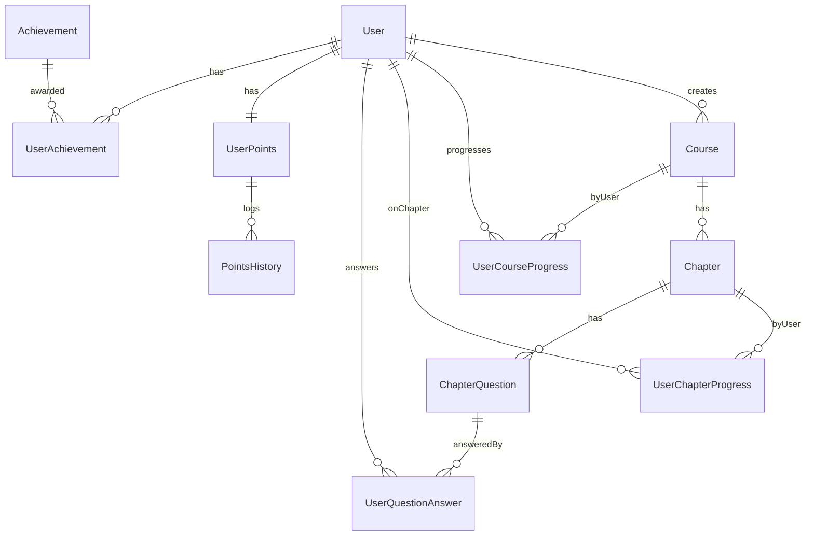

# 项目技术架构与接口总览（基于 src 目录）

本文从 `src` 目录出发，合并“结构与功能概览”与“API 接口与数据模型”两份文档，提供统一的技术全景：目录结构、页面职责、组件与状态、AI 能力与封装、tRPC 架构、服务端与鉴权、接口清单（tRPC + REST）、数据模型（ER）与关键用户流程。

## 简介

- 站点定位：智学奇点 - AI 驱动的个性化学习平台（个性化学习、AI 生成课程与评估、内容分享/广场）。
- 技术栈：Next.js App Router、tRPC、Prisma、NextAuth（GitHub 登录）、Zustand、Tailwind + shadcn/ui、ai-sdk（OpenAI/Google/Zhipu）、TanStack Query、SuperJSON。

## 目录总览（src）

```
src/
  app/                 # Next.js App Router 路由与页面
    layout.tsx        # 全局布局（SessionProvider + TRPCReactProvider + Toaster）
    page.tsx          # 首页（价值主张 + 入口 CTA）
    create/           # 课程创建页
    explore/          # 内容广场（课程探索）
    dashboard/        # 用户仪表盘（学习中/已完成/我创建的）
    course/[id]/      # 课程学习页（章节列表 + 内容区 + 学习进度）
    api/              # Next.js API 路由（ai/chat、ai/generate-chapter、auth、trpc）

  components/          # 共享组件（课程模块、AI 面板、UI 基础组件）
    ai-chat-panel.tsx
    course-card.tsx
    course-header.tsx
    course-content-area.tsx
    chapter-list.tsx
    chapter-content.tsx
    markdown-renderer.tsx
    navbar.tsx
    ui/               # shadcn/ui 扩展组件

  lib/                 # 工具与 AI 封装
    openai.ts         # 统一模型选择（OpenAI/Google/Zhipu）与生成参数
    course-ai.ts      # 课程相关 AI 任务：标题/描述/大纲/章节提问/评估

  store/               # Zustand 状态
    ui-store.ts       # 按钮/模态/加载/错误
    course-store.ts   # 课程内状态（当前选中章节等）
    pointsStore.ts    # 积分/等级/成就/排行榜
    learningVerificationStore.ts  # 学习验证（题目、作答、评估结果）

  trpc/                # tRPC 客户端集成
    react.tsx         # TRPCReactProvider、客户端 api 实例
    server.ts         # RSC 端 tRPC 调用封装
    query-client.ts   # TanStack Query 客户端默认配置

  server/              # 服务端（tRPC、DB、Auth）
    api/
      trpc.ts        # tRPC 上下文/过程/中间件
      root.ts        # AppRouter 聚合
      routers/       # 业务路由（course、learningVerification、points、achievements、chapter）
    auth/
      config.ts      # NextAuth 配置（GitHub Provider）
      index.ts       # 导出入口
    db.ts            # Prisma 客户端

  types/               # 领域与接口类型
    course.ts         # 课程/章节/统计/卡片等类型
    api.ts            # tRPC/接口输入输出类型
    store.ts          # 各 Store 的类型
    learning-verification.ts

  styles/
    globals.css       # Tailwind 全局样式

  env.js               # zod 校验的环境变量定义
```

## 应用路由与页面职责（src/app）

- `layout.tsx`：注入全局 Provider（`SessionProvider`、`TRPCReactProvider`），注册 `Toaster`；设置 `metadata`。
- `page.tsx`：首页，展示核心功能（AI 内容生成、个性化学习、内容分享、智能评估）与 “创建/探索” 入口。
- `create/page.tsx`（创建课程）：
  - 通过 `api.course.generateTitleAndDescription` 生成课程标题+描述；
  - 确认后调用 `api.course.createOutline` 生成大纲并跳转 `/course/{id}`。
- `explore/page.tsx`（内容广场）：
  - `api.course.getPublicCourses.useInfiniteQuery` 列表，支持搜索与视图切换（网格/列表）。
- `dashboard/page.tsx`（仪表盘）：
  - 标签页：学习中、已完成、我创建的；均支持无限分页与统计汇总。
- `course/[id]/page.tsx`（课程学习）：
  - 获取课程详情、章节进度（`api.learningVerification.getCourseProgress`）；
  - 左侧 `ChapterList`，右侧 `CourseContentArea`；内含 AI 学习助手与学习验证流程。

## 组件与渲染（src/components）

- 学习组件：`course-header.tsx`、`chapter-list.tsx`、`chapter-content.tsx`、`course-content-area.tsx`、`course-card.tsx`、`navbar.tsx`。
- Markdown 渲染：`markdown-renderer.tsx` 集成 remark-math、rehype-katex、代码高亮与 mermaid。
- AI 学习助手：`ai-chat-panel.tsx` 基于 `@ai-sdk/react` 的 `useChat`，直连 `/api/ai/chat`。
- UI 基础库：`components/ui`（shadcn/ui 组件与增强按钮、表单、弹窗等）。

## 状态管理（src/store）

- `ui-store.ts`：通用 UI 状态（按钮/模态/加载/错误），选择器：`useButtonState`、`useModalState`、`useLoadingState`、`useErrorState`。
- `course-store.ts`：课程内局部状态（当前选中章节、重置等）。
- `learningVerificationStore.ts`：学习验证（题目、作答、评估、提示/重试、章节/课程进度等），含便捷选择器（是否第一个/最后一个、已回答数、进度百分比、当前答案等）。
- `pointsStore.ts`：积分体系（总积分、等级、经验、排行榜、成就、连续学习奖励等），包含本地即时升级与历史记录更新。

## 类型定义（src/types）

- `course.ts`：课程/章节/学习进度/统计/卡片展示模型。
- `api.ts`：tRPC 输入/输出类型与扩展 Prisma 关系类型（如 `UserWithRelations` 等）。
- `store.ts`、`learning-verification.ts`：Zustand Store 类型与学习验证实体。

## AI 能力与封装（src/lib）

- `openai.ts`：统一模型（OpenAI/Google/Zhipu）与默认生成参数；`DEFAULT_MODEL` 控制默认模型。
- `course-ai.ts`：
  - 使用 `zod` + `generateObject` 保障结构化输出；
  - 能力：`generateTitleAndDescription`（课程标题/描述）、`generateCourseOutline`（大纲）、`generateChapterQuestions`（苏格拉底式问题）、答案评估 schema 等。

## tRPC 架构（src/trpc + src/server/api）

- 客户端：
  - `trpc/react.tsx` 提供 `api` 客户端与 `TRPCReactProvider`，启用 `loggerLink`、`httpBatchStreamLink`、`SuperJSON`，集成 TanStack Query；
  - `trpc/server.ts` 为 RSC 提供 `createCaller` 与水合工具。
- 服务端：
  - `server/api/trpc.ts`：上下文/过程/中间件（鉴权/错误处理等）；
  - `server/api/root.ts`：聚合路由为 `AppRouter`；
  - `server/api/routers/*`：`course`、`chapter`、`learningVerification`、`points`、`achievements`。

## 服务端与鉴权（src/server）

- 数据库：`server/db.ts` 提供 Prisma 客户端（开发模式复用全局实例）。
- 鉴权：`server/auth/config.ts` 配置 NextAuth（GitHub Provider），前端 `Navbar` 调用 `signIn/signOut`，`layout` 通过 `SessionProvider` 提供会话。

## API 路由（src/app/api）

- `api/trpc/[trpc]`：tRPC HTTP 入口。
- `api/auth/[...nextauth]`：NextAuth 登录/回调入口。
- `api/ai/`：
  - `chat`：`POST /api/ai/chat`，`useChat` 消费的 AI 聊天。
  - `generate-chapter`：`POST /api/ai/generate-chapter`，章节内容流式生成。

## 环境变量

- 服务器端（zod 校验）：`AUTH_SECRET`（生产必填）、`AUTH_GITHUB_ID`、`AUTH_GITHUB_SECRET`、`DATABASE_URL`、`NODE_ENV`。
- AI 相关：`OPENAI_API_KEY`、`OPENAI_BASE_URL`、`OPENAI_MODEL`、`GOOGLE_API_KEY`、`GOOGLE_MODEL`、`ZHIPU_API_KEY`、`ZHIPU_BASE_URL`、`ZHIPU_MODEL`、`DEFAULT_MODEL`。

## 典型数据流

1. 前端（App Router）→ tRPC 客户端（React Query/SuperJSON）→ 服务端路由（`server/api/routers/*`）→ Prisma/AI → 返回序列化数据 → 客户端缓存与水合。
2. AI 聊天/章节生成等也可由 Next.js API Route（`/api/ai/*`）直接消费（如 `useChat`）。

## 关键用户流程

- 创建课程：输入需求 → AI 生成标题/描述 → 编辑 → 创建大纲 → 跳转课程页。
- 探索课程：分页检索课程（搜索/视图切换/统计卡片）。
- 我的课程：按状态/角色（学习/完成/我创建）查看与分页加载，展示整体学习进度。
- 课程学习：章节阅读 + Markdown（数学/代码/mermaid） + AI 学习助手 + 学习验证（题目/评估/进度）。
- 积分成就：学习与验证过程中本地即时更新积分/等级/成就，服务端配合持久化与排行榜。

---

## 接口清单（tRPC）

### Router: `course`

- `mutation generateTitleAndDescription({ userInput })` → `{ title, description }`
- `mutation createOutline({ title, description, level })` → `{ course, chapters }`
- `query getUserCourses({ limit?, cursor?, status?, createdByMe? })` → `{ courses, nextCursor? }`
- `query getById({ id })` → 课程详情（含 `creator`、`chapters` 升序）
- `query getPublicCourses({ limit, cursor? })` → `{ courses, nextCursor? }`
- `mutation publish({ courseId })` → 更新后的 `course`
- `query getChapterById({ chapterId })` → 章节实体

### Router: `chapter`

- `query getById({ id })` → 章节 + 最小化 `course`
- `mutation saveContent({ chapterId, content, generationCost? })` → 更新后的章节
- `mutation rateQuality({ chapterId, score })` → 更新后的章节（质量评分）
- `mutation generateContent({ chapterId, regenerate? })` → 生成/返回章节内容（内部调用 `/api/ai/generate-chapter`）

### Router: `learningVerification`

- `query getOrGenerateQuestions({ chapterId })` → `{ canProgress, totalScore, pointsEarned, feedback, chapterQuestions }`
- `query getQuestions({ chapterId })` → `ChapterQuestion[]`（含最近一次用户答案）
- `mutation submitAnswer({ questionId, answer })` → `{ questionId, answer, isCorrect?, score?, feedback?, submittedAt }`
- `mutation evaluateAnswers({ chapterId, answers })` → `{ canProgress, totalScore, pointsEarned, feedback, chapterQuestions }`（通过则：章节完成、解锁下一章、发放积分）
- `query getChapterProgress({ chapterId })` → 当前用户章节进度
- `query getCourseProgress({ courseId })` → 当前用户课程内所有章节进度（按章节序）
- `mutation initializeCourseProgress({ courseId })` → 初始化课程进度并解锁第一章

### Router: `points`

- `query getUserPoints()` → `UserPoints`（如无则创建，含最近 `pointsHistory`）
- `query getPointsHistory({ limit, cursor? })` → `{ history, nextCursor }`
- `query getLeaderboard({ type = "points"|"level", limit })` → `{ leaderboard, userRank }`
- `mutation updateStreak()` → `{ streak, bonusPoints }`（更新积分与历史）
- `query getUserStats()` → `{ userPoints, completedCourses, completedChapters, averageScore, achievementsCount }`

### Router: `achievements`

- `query getAllAchievements()` → 成就 + 是否解锁/解锁时间
- `query getUserAchievements()` → 当前用户已解锁成就（含详情）
- `mutation checkAndUnlockAchievements()` → 新解锁成就清单，并发放积分
- `mutation initializeDefaultAchievements()` → 初始化默认成就 `{ message, count }`

---

## REST / Edge API 接口清单（Next.js Route Handlers）

- `POST /api/ai/chat`（需登录）
  - 入参：`{ courseId: string; chapterNumber: number; messages: { role: "user" | "assistant"; content: string }[] }`
  - 返回：流式文本；以当前章节 `contentMd` 作为 system 上下文。
- `POST /api/ai/generate-chapter`（需登录）
  - 入参：`{ chapterId: string; courseTitle: string; chapterTitle: string; level: "beginner" | "intermediate" | "advanced" }`
  - 返回：流式文本；生成完成后持久化到 `Chapter.contentMd`，记录 token 消耗与更新时间。
- `GET|POST /api/trpc`：tRPC 统一入口。
- `GET|POST /api/auth/[...nextauth]`：NextAuth 认证与回调入口。

---

## 数据模型（ER）与字段要点（基于代码推断）

### ER 图（Mermaid）



### 模型要点

- `User`：关系 `createdCourses`、`courseProgresses`、`userPoints?`、`achievements`。
- `Course`：`id, title, description, creatorId, isPublic?, joinedByCount?`；关系 `creator`、`chapters`。
- `Chapter`：`id, courseId, chapterNumber, title, description, contentMd?, contentQualityScore?, generationCost?, lastUpdated?`。
- `UserCourseProgress`：`id, userId, courseId, status(IN_PROGRESS|COMPLETED), updatedAt`；关系 `chapterProgresses`。
- `UserChapterProgress`：`id, userId, courseId, chapterId, status(LOCKED|UNLOCKED|COMPLETED), unlockedAt?, completedAt?`。
- `ChapterQuestion`：`id, chapterId, questionNumber, questionText, questionType, questionCategory, difficulty, hints[], options?`。
- `UserQuestionAnswer`：`id, userId, questionId, answer, aiScore?, aiFeedback?, isCorrect?, aiSuggestions?, createdAt, updatedAt`。
- `UserPoints`：`userId(PK), totalPoints, level, currentExp, expToNextLevel, streak?, lastActiveDate?`。
- `PointsHistory`：`id, userId, pointsChange, reason, description?, relatedId?, createdAt`。
- `Achievement`：`id, name, description, icon, category, condition(string), points, isActive?, createdAt, updatedAt`。
- `UserAchievement`：`id, userId, achievementId, unlockedAt`。

---

## 快速参考

- `protectedProcedure` → 需登录；`publicProcedure` → 可匿名。
- 生成类能力由 `lib/course-ai.ts` + `lib/openai.ts` 提供，受环境变量控制默认模型与参数。
- 评估通过会触发：章节完成、下一章解锁、积分更新；排行榜/成就依赖 `points` 与 `achievements` 路由。

## 备注与扩展建议

- tRPC 路由与 Prisma 模型是业务能力核心，前端 `api.*` 与 Store 状态流程强绑定，修改时同步更新 `types/*`。
- 新增 AI 能力建议复用 `zod` schema + `generateObject`，确保返回结构可靠。
- `markdown-renderer.tsx` 已集成公式/高亮/mermaid，如需导出/复制可按注释扩展。
